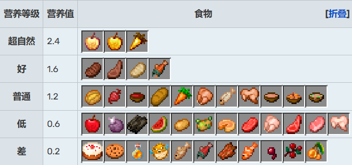

# 入门玩法介绍

在 EHC 中，首先需要注意的是，这是一个生存游戏，然后才是 pvp。你首先要生存下来。同时，你不是一个人，你有的是队友。因此，团队合作非常的重要。在开始游戏之前，请务必管理好语音系统，好的沟通是游戏胜利的重要因素。

## 前期

既然是生存游戏，那么活下来就是非常重要的。生存的第一要素就是食物，有了食物才能有发展，食物的缺乏甚至会导致挖矿中断以及 pvp 弱势。同时，我们也不能忽略其 pvp 的属性，为了后期的顺畅发展，前期必须打好基础。因此，综合考虑各种因素，这里推荐每个队伍至少派出 1~2 个队员在开局的时候跑图。

### 食物

跑图的第一要务就是收集食物。

#### 解析

在比赛中，一般最常见的食物就是动物的肉。动物的肉，特别是猪肉牛肉，是最高质量的食物，其在 pvp 中有着巨大的用途，可以快速回血。一般情况下，肉类的质量排序 牛/猪 > 羊/鸡/鱼/兔子 。

还有一个常见的食物，就是低饱和的自然植物，例如甜浆果、发光浆果、西瓜、蘑菇(合成蘑菇煲)和苹果。除了最后两个，其他往往在合适的地形可以大量找到。这些食物不饱腹，且回血能力弱，不推荐在 pvp 中食用。但是可以用于前中期发育的时候过渡用，用于节约宝贵的熟肉类。而蘑菇，可以用于合成蘑菇煲，其回复量和羊肉相当，更加适合作为贯穿前中后期的通用食物，唯一的缺点是不可堆叠。苹果，无论如何都不要直接吃，其合成金苹果后，效果会变强很多，一般作为战略物资。

而农作物例如小麦、胡萝卜、马铃薯，由于其过长的生长周期，可能不太适用于较快节奏的 EHC 比赛。但是，如果玩家中后期去下界，并且在灵魂沙峡谷获得了大量的骨块，或者是通过各种途径获得了大量骨头/骨粉，那么玩家可以考虑在中期无 pvp 阶段用农作物产品的食物代替肉类，从而为后期 pvp 省下更加宝贵的食物。特别地，如果有胡萝卜，请一定要保留，用于后期合成金胡萝卜，这是因为金胡萝卜的饱和度极高，可以用于战斗中快速回血。

推荐顺序: 金苹果 > 牛/猪/金胡萝卜 > 羊/鸡/鱼/兔子 > 蘑菇煲(因为不可堆叠) > 烤马铃薯 > 胡萝卜 > 其他大部分

附: [wiki](https://minecraft.fandom.com/zh/wiki/%E9%A3%9F%E7%89%A9)上的食物价值表.......

#### 收集

由于开局前有 120s 的观察时间，因此跑图者需要提前观察好地形。动物会在温带或亚寒带的各种地形生成，包括但不限制于山脊、平原、森林等等。相应地，我们也要避开一些地形，例如沙漠、恶地、丛林、萨瓦纳草原、冰刺雪地等等，这些地形往往缺少动物，或者获取食物的成本较高。

特别地，如果有村庄，请一定要去! 因为村庄会有大量的干草块，分解后的面包数量足以让一个队伍不再需要杀动物。村庄的箱子里也会有额外的食物，甚至是其他的装备，矿石等等。

如果实在找不到前面所说的温带地形或者村庄，或者此类地形分布太远，来不及跑过去，那么可以选择替代方案: 捕鱼。虽然鱼的饱和度不如牛排和猪排，但是熟鲑鱼依然可以不输羊排，熟鳕鱼同样不输熟鸡排。一般在河流和海洋群系，可以找到大量的鱼肉，一个人打鱼 5 min 往往足以提供给全队足够的食物，前提是有足够的技巧以及合适的地形。

如果几乎找不到前面所说的任何一个群系，例如在一片全是荒地的地图生存，那么请一定要在开局时找准河流，这是因为河流是整个地形唯一会刷动物的地方，这也意味着刷动物的总量全部汇聚到了那里。在这样的情况下，打鱼会有着超乎想象的效率。

如果连水池都找不到一片，比如整个地图都是沙漠，那么请一定要和队友走在一起。推荐把食物聚集给一个队友，让其尽量不要受伤，持有全队最多的经验(用于附魔)，然后其他队友可选择在饥饿的时候战术性自杀，传送回来来回满血量和饱食度。同时，打僵尸掉落的腐肉也是一个很不错的食物来源，推荐在很饿的时候，一次性吃很多腐肉回血回饱食度，可以减少腐肉带来的负面影响。

### 资源

跑图的第二要务就是收集资源，主要以地表资源为主。

#### 解析

mc 中的资源有很多。而能在前期快速收集的资源，最常见的就是甘蔗。甘蔗属于非常稀缺，但后期特别重要的资源，其可以制作书，而附魔业是决定了 pvp 胜负的关键因素。

除此之外，资源还包括村庄，遗迹，沉船等等。此类资源往往在开局便可以看见。村庄提供大量的资源，以及铁傀儡的铁可用造盾，平稳化前期发育；各种遗迹资源丰富，同样可以加速前期发育；沉船的资源更不用说了，如果能找到埋藏的宝藏，那么几乎可以直接进入钻石时代了......

当然，还有其他不那么突出的地表资源。其包括峡谷矿洞信息(是否有暴露出深层矿洞结构)，以及地表矿物信息(铁矿石)等等。

#### 收集

收集此类资源要求观察者有着极好地地形意识，因为往往目的地需要跨过不同的地形才能安稳到达，过程中也可能遇到各种阻碍。因此，推荐全队中综合实力比较强的人，带上的少许队友去收集。

如果有明显地标如村庄，那么争抢肯定比较激烈。这种时候往往需要较多的人一起前往。不要以为隐身阶段就不会死人!

在此之后，最重要的战略资源想必是甘蔗。每个队伍应当保证队伍有至少一本书，或者不少于 3 个甘蔗，否则附魔业受到阻塞，后期 pvp 将会非常吃亏。

当然，以上所有的操作都依赖于观察阶段预先观察，所以观察阶段千万别摸鱼哦。

## 中后期

中期是主要是发育时间，在这个阶段玩家会更多地见面。由于是入门玩法介绍，这里就不过多分析了，但是可以指出一些常用打法。

### 速通流

这种打法讲究的是快，通过走矿洞快速地发育，更早的进入地狱，借助地狱的某些资源(例如猪堡、重生锚)，以及发育中挖到的钻石，快速的压制对手。

速破对个人 mc 水平的要求较高，而且也非常依赖前期的状态(即前期是否有村庄/沉船，食物是否充足)，和敌人碰面打架的机会也会更多，后期也有足够的时间去做其他事情。其适合在本身富裕的情况下，压制敌方发育(比如限制对面进地狱，以及前中期打架杀人)，从而保证优势。

### 矿工流

这种打法比较不需要食物资源。玩家主要在基岩层附近探巨大矿洞，以及鱼骨，获得数量众多的钻石，利用装备压制在最终 pvp 中击败对手。

矿工对于食物的需求量非常低，而且危险性也不高。其发育周期比较平缓而偏长，往往要到开始缩圈了才能有足够的钻石，这甚至可能导致没有时间去地狱和叠附魔，但是安全也是真的安全。其适合地表资源匮乏的情况，用于稳定发育，避免与人发生冲突，保全实力，拼最终 pvp。

### 魔法流

这种打法主打的是附魔以及装备压制 (狭义上的魔法，一般情况下难以获得)，需要大量的书(甘蔗)和经验作为支撑。

附魔的难点主要是经验，但是经验可以通过以下三个途径大量获得: 刷怪笼，幽暗之域，下界石英。一般情况下，会选用后两者。该打法的核心是利用经验叠出高级附魔 (力量 IV/V,无限 I,锋利 III/IV,(弹射物)保护 III/IV)，其需要玩家对于附魔机制有一定的了解，需要一定的附魔材料。当然，也可以通过钓鱼获取一些好的附魔书。

