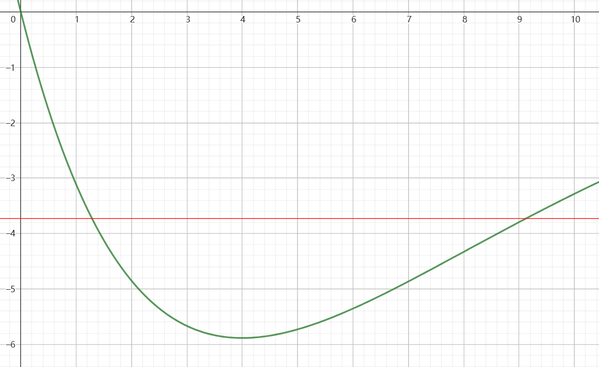

# 4.1

水蒸气蒸发上升的过程，从外界吸热 (环境吸热 / 太阳辐射) ，将空气的内能 / 太阳光携带的能量 (光子能量) 转化为水蒸气的内能和重力势能。

在汇聚成云的过程中，水蒸气发生了物态变化放出热量，内能转化为周围空气的内能。

风吹动的过程，空气分子的动能转化为云的动能。

下雨的过程，我还是没搞清楚凝结核导致的正反馈效应导致的下雨算是啥能量转化。但是雨水的下落时，雨水的重力势能转化为了雨水的动能和水/空气的内能 (空气阻力做功)。

河流流到其他地方，属于是水的重力势能转化为水的动能和内能(水的内部摩擦 + 和岸边的摩擦)。

# 4.2

常见的锂电池能量密度大概在 $150 W \cdot h \cdot kg ^ {-1} $，而电池重量大约为 $0.15 kg$ 。

计算得容量大约为 $6000 mA\cdot h$

# 4.3

载人电梯减去配重后净重最多为 $1t$，加上配重后总重量大概为 $5t$。我们估算电机效率为 $50%$ ，则1度电有效电功为 $0.5 kW\cdot h = 1.8 \times 10^6 J $。

我们假设电梯最高速度为 $6m\cdot s^{-1}$ ，且不考虑减速过程中的减速耗能(主动做功减速)或者减速储能(比如用电磁感应把动能转换回电能)。所以 $1$ 度电用最多能提升的重力势能为 $1.8 \times 10^6 J - \frac12 \cdot 5000 kg \cdot (6m\cdot s^{-1})^2 = 1710000 J $ 。记重力加速度为 $9.8 m\cdot s^{-2}$ 可以将乘客抬高 $$ \frac{1710000J}{1000kg \cdot9.8 m\cdot s^{-2}} = 174m$$ 。

事实上，$174m$ 是一个很高的高度。上海六层楼以上就必须加装电梯，6层楼大约是 $20$ ~ $30 m$ 高，而这个高度以上几乎没有人会习惯走路上去了。所以一度电是一个不合理的估算。

我们假设上升的高度为 $20m$ ，所需总能量为 
$$\frac{1}{50\%} \cdot(\frac12 \cdot 5000 kg \cdot (6m\cdot s^{-1})^2 + 1000kg \cdot9.8 m\cdot s^{-2} \cdot 20m ) = 5.72 \times 10 ^ 5 J = 0.159 kW \cdot h $$
满载 + 满速大约为 0.16 度电，也没到 1 度电。

# 第8章

38 图

