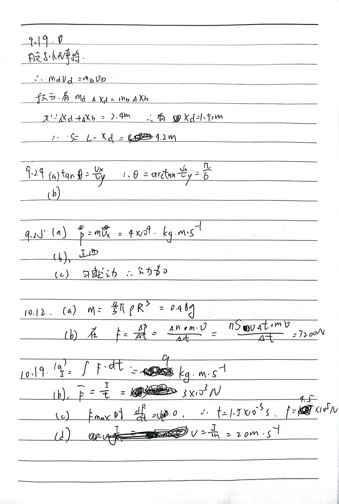
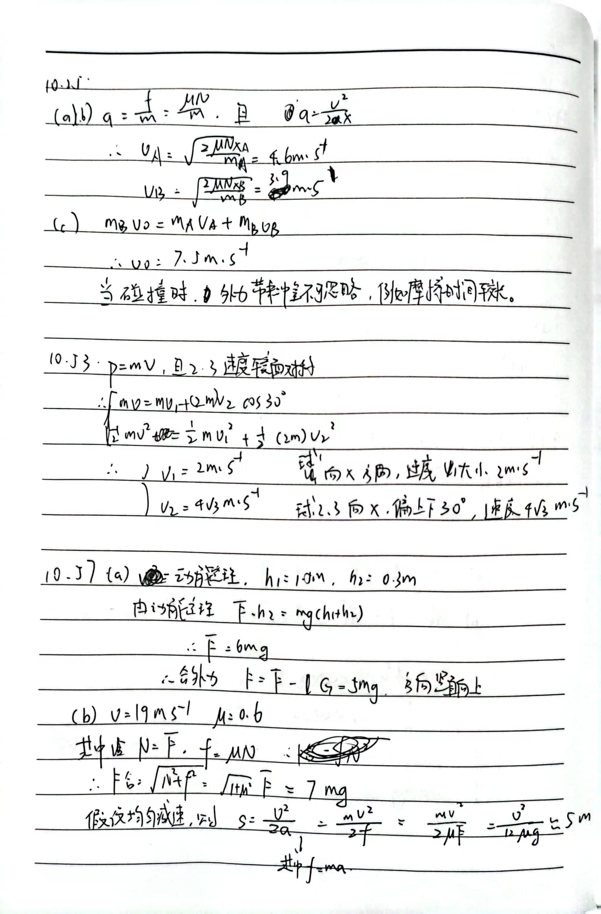

# 6.1

$$ 
F = \frac {\Delta p}{\Delta t}
$$
其中,
$$
\begin {aligned}
\Delta{p} &= \Delta m \Delta v  \\
          &= \rho S v \Delta t v \\
          &= \rho S \Delta t v^2
\end {aligned}
$$
因此，
$$
F = \rho S v^2
$$
满足:
$$
F \propto v^2
$$
即 $ F $ 随着 $v$ 增大而增大，粗略估计为平方正比关系。

在圆形轨道上，$v^2 = \frac{GM}{R} = gR$

带入 $R \simeq (6400 + 200) km$ , $\rho = 1.6×10^{-10}kg \cdot m^{-3}$ , $m = 10 kg$ , $S = 0.5 m ^2$ , $ v^2 = gR$ , $F = \rho S v^2$ , $F = ma$

特别地，转一圈周期 $T = \frac{2\pi R}{v}$

计算得到:
$$
F = 5 \times 10 ^{-3} N
$$

转一圈的影响为
$$
\frac{\Delta v}{v} = 2\pi \frac{\rho S R}{m} = 3 \cdot 10 ^ {-4}
$$
影响很小，几乎可以忽略，但还是需要考虑。

# 6.2

火箭是多级推进，每一级内部是连续喷射燃料推进。在一次推进中，我们假设喷出燃料相对机体的速度为 $v_0$ ，那么产生推力:

$$ F = \frac{\Delta p}{\Delta t} = \frac{\Delta m}{\Delta t} v_0$$

加速度:
$$ a = \frac {F - G} m = \frac F m - g  $$

我们假定 $\frac{\Delta m}{\Delta t}$ 和 $v_0$ 恒定。可以看出，火箭会有一个较为平缓的推力。而一般来说 $\Delta m \lt \lt m$ ，g 随高度变化也较慢 ，因此加速度也相对比较稳定。

而大炮是在爆炸瞬间产生巨大的推力，平均值设为 $F$ , 作用一个很短的时间 $\Delta t$ 。因此带来动量 $ \Delta p = F \Delta t $ ，有巨大加速度 $ a = \frac{\Delta v}{\Delta t}$ 

显然，由于火箭推进的方式，在上升的过程中，额外提升了部分燃料的重力势能，因此必然会消耗更多的能量，也就依赖更多的能量。而大炮则不会这样，因此，需要的能量更小。

但是，火箭推进是多段加速，加速度更加稳定，人在里面能存活。而大炮推进则是单次加速，因此加速度较大，例如假设加速到第二宇宙速度 $v = 11.2 km \cdot s^{-2}$ ，假设人最多能承受加速度 $ 100g \simeq 1000 m \cdot s^{-2}$ ，则炮管长度 $h = \frac{v^{2}}{2 a} = 62.7 km$ 显然不可能。

## 6.3

由 6.2 , 显然一次抛出所需速度最小。

若能逃出，地球至少需要获得额外速度 $\Delta v_1 $ 。对于抛出的部分，假设其相对地球的速度为 $v_0$ (不考虑引力作用) ，假设抛出部分质量为 $m_2$ ，地球质量为 $m_1$ ，因此，满足抛出瞬间:

$$
\begin{aligned}
m_1 v_1 + m_2 v_2 &= 0  \\
v_1 - v_2         &= v_0
\end{aligned}
$$

而之后会受到引力势能作用，$\Delta E_k + \Delta E_p = 0$ ，而均匀球体，由积分得到引力自能为 $ -\frac{3GM^2}{5R} $ 。所以假设分开后地球引力自能为 $E_1$ ， 抛出部分为 $E_2$ ，初始为 $E_0 = -\frac{3GM^2}{5R}$ 。

因此，$\Delta E_k = E_0 - E_1 - E_2 $ 。

为了让 $v_0$ 尽可能小，我们需要让 $E_1,E_2$ 尽可能地小。我们假设密度不会发生改变，那么引力势能最小即聚为球体。 

由于 $m_1 v_1 + m_2 v_2 = 0$ 恒成立，因此，

$$\frac {E_{k1}} {E_{k_2}} = \frac {m_2} {m_1}$$

特别地，$m_1 + m_2 = M = const$ 。

得:
$$
{v_0}^2 = \frac{(m_1 + m_2)^2}{{m_2}^2} {\Delta v_1}^2 - \frac{2M}{m_1 m_2} \Delta{E_p}
$$

设 $m_2 = \alpha M$ ,

则

$$
{v_0}^2 = \frac 1 {{\alpha}^2} {\Delta v_1}^2 - \kappa \frac{\alpha ^{\frac 5 3} +(1 - \alpha) ^{\frac 5 3} - 1}{\alpha (1 - \alpha)}
$$

其中 $ \kappa = \frac{6GM}{5R} = \frac {6gR} 5$

带入 $g = 9.8 m \cdot s ^ {-2},R = {6400km}$

得出，当 $\alpha$ 无限趋向 1 ，取到最小值，即 $v_0 = \sqrt{{\Delta v_1}^2 + gR}$ 。由定义，rhs 即为第三宇宙速度，所以最小为 $v = 16.7 km \cdot s ^{-1}$ 。此时扔出的质量为几乎全部地球质量 (相当于流浪飞船了)。

