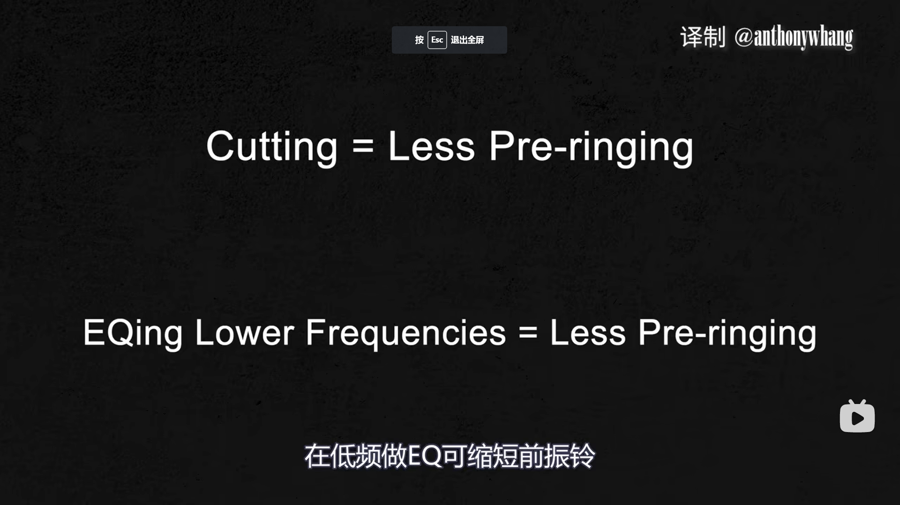

# 啥 ~~jb~~ 是 EQ

https://www.bilibili.com/video/BV1p94y197U2

## 相移不一定不好!!!!

最小相位 EQ
- 有相移
- 没有延迟

线性 EQ
- pre-ringing 效应，弱化瞬态，映入延迟。
- 无相移

瞬态好: 最小相位 EQ

平行 EQ: 线性 EQ 避免相位问题

## Tips

1. 衰减EQ 分离频段，突出两边的频段，在频段上产生空间。
    * EQ 感知本质是取决于周围频段的环境
    * 切的越多，headroom 越多。
    * e.g. 常见 hiphop 流行如果要强 sub-bass ，可以切掉 100 - 400 Hz
2. 基频是声音的根本，力量。而泛音则决定了纹理和音色。
    * 当过多基频堆积的时候，可以试试切掉低频，堆音色。
    * 阴间寄巧: 用衰减 EQ 扫频一个乐器(在整个混音中听)，如果发现一个频段衰减后没咋改音色，切掉。
3. 增益来找到合适的位置。
    * 先减少 5 DB
    * 用一个增益 EQ (类似上衰减EQ法) 找合适的地方

分频:
Sub Bass            0 ~ 100
Bass + Low mid      100 ~ 400 
Mid                 400 ~ 700
High Mids           700 ~ 2000
Highs               2000 ~ 6000
Ultra highs         6000 ~ 20000