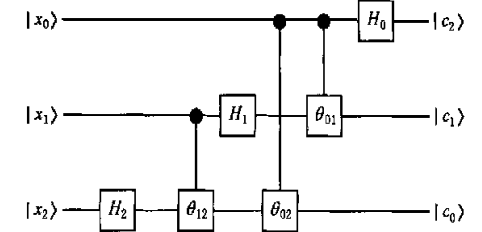

## 量子计算研究报告

&emsp;&emsp;量子计算机是由Feynman于1982年提出的一种新的计算机模型，其利用了量子力学的原则进行工作，从根本架构上不同于传统计算机，在一些特定问题上解决效率能得到巨大的提升。本文将比较简单的分析一下量子计算独特之处，并将谈谈笔者自己的体会。

### 量子计算的物理理论基础

&emsp;&emsp;量子计算机是一种非常独特的设计，其从根本上不同于图灵机的架构，利用的是量子位(Qubit)的独特的物理性质。虽然以下数理分析看似与量子计算无关，但私以为为了解其本质才会更有利于我们设计出新的量子计算算法并获得相关的重大突破，正如我们学习计算机编程也要了解底层原理一样。

&emsp;&emsp;(！！！物理理论相关内容，时间不够可以跳过，由于我对这个比较感兴趣所以随便研究了一下下)。

&emsp;&emsp;具体来说，由于微观世界中高速运动的粒子的物质波可以达到了粒子的尺寸(或者物理里面常说的特征长度)，甚至超过了这一数量级，其容易呈现出经典粒子所不具有的波动性，即我们不再能用经典模型尝试去准确刻画一个粒子所在的位置，而需要用概率波(或者概率密度) $\Psi$ 去刻画粒子的行为。通过薛定谔方程，我们理论上上可以求解出一个粒子在给定的条件下(如势垒给定)，处于某一种状态的概率，例如 $\int_V |\Psi(\vec {r},t)| d^3r$ 可以表示该粒子出现在 $V$ 这个空间里面的概率，而 $\int_P |\Phi(\vec p,t) d^3p$ 则表示粒子出现在 $P$ 这一动量空间的概率。

&emsp;&emsp;而这一概率密度函数即所谓概率波，其具有波的基本性质——叠加性。因此，在求解一个微观体系的波函数的时候，我们(特别是物理学家)往往可以并且倾向于将其分解为的一组概率密度相互正交归一的解的叠加。在这里，正交指的是任意不同的两组解概率密度的内积(不是简单的乘积，是一个乘上另外一个的共轭)对全空间积分值为0，归一指的是每一组解自身的内积对全空间为一，即每一组解本身对应着一个可行的解。在做出以上分解后，我们便可以把任何的满足薛定谔方程的解表示为这些正交归一解的叠加，例如设正交归一解为 $\Psi_n(x,t)$ , 即

$$
\int_{V_{all}} \Psi_n(\vec {r},t)^*\cdot \Psi_m(\vec {r},t) d^3r = \delta_{mn}
$$

(其中 $^*$ 为取共轭，而 $\delta_{mn}$ 当且仅当 $m = n$ 时为1，否则为0。)

&emsp;&emsp;对于任意可行解 $\Psi$，我们均可以将 $\Psi$ 写做 $\Psi_n$ 的叠加，即

$$
\Psi(\vec {r},t) = \sum_{n=0}^{\infty} c_n \Psi_n(\vec {r},t)
$$

又由于归一化条件的限制，以及正交归一的条件，我们容易证明

$$
\sum_{n=0}^{\infty} |{c_n}|^2 = 1
$$

&emsp;&emsp;虽然其处在每个解的概率不同，但是当我们进行观测的时候，其只会处在其中的一种解。

&emsp;&emsp;通过一些算符，我们就可以得到该粒子在这个微观体系种对于的物理量的概率分布(例如哈密顿算符，动量/位矢算符)，或者是一个量子态转换为另一个量子态(例如谐振子的上升/下降算符)。算符一般记作 $\hat{A}$。

&emsp;&emsp;对于可观测量的算符，在计算时只需将其插入波函数的内积中即可。例如，对于位置 $\vec r$ ， 其算符 $\hat {\vec r} = \vec r$ ，因此该粒子期望位置为

$$
\vec r_0 = \int_{V_all} \Psi^*(\vec {r} ,t) \cdot \vec {r} \cdot \Psi(\vec {r} ,t) d^3r
$$

&emsp;&emsp;对于态转换算符，其需要直接作用在波函数上改变波函数，并使得归一化条件依然被满足，根据计算容易得到 $\hat A^* \cdot \hat A = 1$。

&emsp;&emsp;值得一提的是，量子物理中观测是个非常重要的手段，观测会使得波函数坍缩到一个固定的解，而重复观测只会得到一样的解，正如“薛定谔的猫”的实验中，一旦进行观测，猫的死活就确定了。这意味着我们并不能通过对同一体系进行多次观测来获取更多的有效的数据。同时任何一个量子态是不可复制的，用线性代数的知识容易证明不存在一个复制量子态的算符。

&emsp;&emsp;同样值得一提的是，我们还可以使得一些量子位处于纠缠态。举个粒子，两个量子位，当一个的状态被确定以后，另外一个的状态也可以立刻被确定。这看上去有一点超距作用，但观测一个量子的过程，并没有向另外一个量子的传递任何信息，并不违反相对论。而即使我们不进行观测，量子也会由和外界的相互作用导致量子纠缠随时间丧失，这个过程称作去相干。这些细节的东西会极大的影响量子计算机的设计，也会给制造量子计算机带来不同程度的挑战。

### 量子计算的计算原理

&emsp;&emsp;先暂时简化模型为一个简单的单微粒体系，其只有两种量子态，记作0和1。对于任意可行的波函数 $\Psi$ ，可将其表示为 $\Psi = \alpha\Psi_0 + \beta\Psi_1$，其中 $|\alpha|^2 + |\beta|^2 = 1$。这样一个量子态可以认为是处在0态和1态的叠加态，并且呈现为0态和1态的概率不同。

&emsp;&emsp;为了便于表示，我们将任何一个态用 $\mathbb{C}^2$ 中的一个列向量表示，上述情况即记作ket x: $|x>  \ \   = [\alpha,\beta]^T$ ，而将一个态的共轭转置记作bra x: $<x| = [\alpha^*,\beta^*]$，。而将一种量子态变成另外一种量子态，我们需要设计转换算符，而从任意列向量到另外的列向量的转换只需要一个矩阵，因此在这种情况下转换算符本质是一个 $2 \times 2$ 的方阵，记作 $A$。由归一化条件的限制，我们不难得出:$\tilde A^{T} \cdot A = \mathbb{I}$ ，其中 $\tilde {A}$ 为 $A$ 的共轭，$\mathbb{I}$ 为单位矩阵。

&emsp;&emsp;由线性代数的知识，我们可以看出一个 $2 \times 2$ 成为算符的必要条件为 $|det(A)| = 1$。而且 $\tilde A^{T} = A ^{-1}$，这意味着任何两个态之间的转换都是可逆的，都可以再通过 $A^{-1}$ 的操作变换回来。

&emsp;&emsp;由定义，我们不难发现该粒子系统的0/1态分别可以用 $[1,0]^T$ 和 $[0,1]^T$ 来表示，因此可将任意一个态写作 $|x> = \alpha |0> + \beta |1>$。 我们把这样的一个单微粒体系称为一个量子位。其本质就是由0/1态叠加而成，类似于经典计算机中的一个bit，但是其又由于量子叠加的性质，不是离散的0/1，而是可以处于其中的任何一个叠加态。

&emsp;&emsp;而对于多个微粒的系统，我们只需简单的把ket相乘就能得到总共的态，即 $|x> = |x_1> \otimes |x_2> \otimes ... \otimes |x_n>$。其中 $\otimes$ 为张量积运算符。类似地，我们也可以得出其本质是 $2^n$ 个态叠加而成，类似于经典情况下地n个独立地量子态。

&emsp;&emsp;到目前为止，我们可以发现量子计算似乎并没有用处，因为波函数不是可观测量，每次观测你只能观测到一个确定的状态，这样根本谈不上计算。但实际上，量子计算的巧妙之处便在于此：通过设计算法，我们使得那些不是解的态的部分的波函数的振幅相互抵消，而只使得解的的态的概率足够大。这样，我们多体系进行多次观测，出现概率最大的态便是我们所求的答案。这样子看起来有点不切实际，但其实是理论可行的。

&emsp;&emsp;以本质也是概率波的光作为类比。假如有一束偏振的光，其沿着 $x$ 和 $y$ 方向振动，沿着 $z$ 方向传播，我们将其分为两束。这时，如果我们能使一束的沿 $y$ 方向的振动尽可能的反相，那么重新叠加之后，这束光的 $y$ 方向的振动由于相位相消将会被极大的衰减。

&emsp;&emsp;这样一来，在一次量子计算的过程中，n个量子位构成的体系可以同时遍历 $2^n$ 种不同的状态，通过算法的设计使得非解的状态概率尽可能低，再经过多次测量，我们就能得到答案(或者说在一定正确率的条件下得出满足条件的答案)。需要注意的是，在进行观测后，一个量子体系就被确定就会坍缩到一个确定的态，且微观量子态不可复制，这是量子物理所告诉我们的，因此，我们多次测量的对象必须是多次计算后的结果，而不能对一次测量后的结果多次测量。

&emsp;&emsp;不同于传统0/1 bit，n个量子位一次计算可以处理 $2^n$ 种情况，类似于将一个 $2^n$ 的循环在 1 次遍历下完成，在特定的问题上能够获得指数级别的效率提升，这也是量子计算的本质核心。笔者大致总结为：在适当的条件下(利用设计好的算法)，量子计算有极高的并发度，可以快速求解出经典情况下难以处理的问题。

### 量子门

&emsp;&emsp;量子门即作用于量子位上的矩阵，由前面分析的易知，这些矩阵 $A$ 满足 $\tilde A^T \cdot A = \mathbb{I}$ 。注意到等式成立的必要条件是这个矩阵具有可逆性，而现实中很多的逻辑门并不是可逆的。因此，对于 $n$ 个量子位，我们不一定能直接用一个 $2n \times 2n$ 的矩阵来对其进行任意数学操作。这时，我们可能要借助另外的量子位来协助控制这一个量子位的行为。

以下列举了一些常见的合法的量子门：

1. 非门:(交换 0 和 1 态)

$$
\begin{bmatrix} 
0 & 1 \\
1 & 0
 \end{bmatrix}
$$

2. H门:(将 0/1 态转过特定的角度，变为不同的 0/1 组合，常用来制造等概率的 0/1 态)

$$
\frac{1}{2} 
\begin{bmatrix} 
 1 & 1 \\
-1 & 1
 \end{bmatrix}
$$

3. 相移门:(0不变，1概率密度辐角转过 $\theta$，并无逻辑意义)

$$
\frac{1}{2} 
\begin{bmatrix} 
1 & 0 \\
0 & e^{i\theta}
 \end{bmatrix}
$$

4. 异或(输入两个qubit |x>|y>，第一个不变，第二个变为 $x$ xor $y$)

$$
\begin{bmatrix} 
1 & 0 & 0 & 0 \\
0 & 1 & 0 & 0 \\
0 & 0 & 0 & 1 \\
0 & 0 & 1 & 0
 \end{bmatrix}
$$

5. 与门(输入三个qubit |x>|y>|z>，|x>|y>不变，|z>在 $x$ and $y$ 为 true 时 $z$ 取非)

$$
\begin{bmatrix}
1 & 0 & 0 & 0 & 0 & 0 & 0 & 0 \\
0 & 1 & 0 & 0 & 0 & 0 & 0 & 0 \\
0 & 0 & 1 & 0 & 0 & 0 & 0 & 0 \\
0 & 0 & 0 & 1 & 0 & 0 & 0 & 0 \\
0 & 0 & 0 & 0 & 1 & 0 & 0 & 0 \\
0 & 0 & 0 & 0 & 0 & 1 & 0 & 0 \\
0 & 0 & 0 & 0 & 0 & 0 & 0 & 1 \\
0 & 0 & 0 & 0 & 0 & 0 & 1 & 0
 \end{bmatrix}
$$

6. 或门(输入三个qubit |x>|y>|z>，|x>|y>不变，|z>在 $x$ or $y$ 为 true 时 $z$ 取非)

$$
\begin{bmatrix}
1 & 0 & 0 & 0 & 0 & 0 & 0 & 0 \\
0 & 1 & 0 & 0 & 0 & 0 & 0 & 0 \\
0 & 0 & 1 & 0 & 0 & 0 & 0 & 0 \\
0 & 0 & 0 & 1 & 0 & 0 & 0 & 0 \\
0 & 0 & 0 & 0 & 1 & 0 & 0 & 0 \\
0 & 0 & 0 & 0 & 0 & 0 & 1 & 0 \\
0 & 0 & 0 & 0 & 0 & 1 & 0 & 0 \\
0 & 0 & 0 & 0 & 0 & 0 & 0 & 1
 \end{bmatrix}
$$

&emsp;&emsp;实现了基本的逻辑门，我们便可以在量子计算机里面复刻加法器乘法器等最基本的单元。

### 量子计算中的算法

&emsp;&emsp;算法可以说是量子计算机的核心，只有通过巧妙设计使得非解态相位相消才能使得最终解所处的态的概率最大，才能通过多次测量(前面讲过，是重新计算并测量，不能对一次运算结果多次测量)来得到一定正确解，而许多算法都是以量子傅里叶变换为基础的。下面简单分析一下量子傅里叶变换。

&emsp;&emsp;离散傅里叶变换的一般形式是

$$
F(k) = \frac1{2^m}\sum_{n=0}^{2^m-1}(f(n)\cdot e^{\frac{-2\pi i nk}{2^m}})
$$

&emsp;&emsp;令

$$
\phi = e^{\frac{-2\pi i }{2^m}}
$$

&emsp;&emsp;则

$$
F(k) =  \frac1{2^m}\sum_{n=0}^{2^m-1} {f(n) \cdot \phi ^ {nk}}
$$

&emsp;&emsp;其可写作如下形式:

$$
\begin{bmatrix}
F(0) \\
F(1) \\
...  \\
F(2^m-1) \\
\end{bmatrix}

=

T

\begin{bmatrix}
f(0) \\
f(1) \\
...  \\
f(2^m-1) \\
\end{bmatrix}
$$

&emsp;&emsp;其中

$$
T 
=
\frac1{2^m} 
\begin{bmatrix}
1 & 1 & 1 & ... & 1 \\
1 & \phi & \phi ^ 2 & ... & \phi ^ {2^m-1} \\
1 & \phi^2 &... &... & \phi ^ {2(2^m - 1)} \\
... & ... & ... & ... & ... \\
1 & \phi ^ {2^m-1} &  \phi ^ {2^m-1} & 
...&\phi ^ {(2^m-1)(2^m-1)} & 

\end{bmatrix}
$$

&emsp;&emsp;其中 $T$ 便对应了量子傅里叶变换的算符，容易验证其满足算符的基本性质。且其可以有量子相移门和 H 门组合构成。

&emsp;&emsp;如上图，便是一个三个qubit参与的 QFT过程。对于更多位的量子傅里叶变换，容易看出其复杂度只是关于 $m$ 的多项式 P 而不是周期 $2^m$ 的多项式，已经有了极大的效率提升，这便使得其可以成为许多其他量子算法的核心(例如用来大数质因子分解的一个高效算法——Shor算法)。由于篇幅有限，这里将不过多的展开关于其他更深入的量子算法的原理的分析。

<!--  
下面将以 Shor 算法为例进行简要分析。(已废弃)

  Shor 算法是用来大数质因子分解的一个高效算法，其可以利用量子计算的高并发性把NP问题暴力解决，并且由于高并发性，实际执行次数是多项式级别的。具体如下:

  设 $N = p_1 \cdot p_2$ ， $p_1,p_2$ 为素数，$a$ 也为素数。在这样的情况下，构造辅助函数 $f(x) = a^x (mod N)$ 。f(x) 显然是周期函数，不妨设其有一个偶周期为 $T$ ，满足 $f(x) = f(x + T)$，因此 $a^T = 1 (mod N)$，因此 $(a ^{T/2} - 1) \cdot (a ^ {T/2} + 1) = 0 (mod N)$ 。此时，由基本的数论知识，其中一个质数的值即为 $\gcd(a^{T/2}+1,N)$。因此，我们将求质因数的问题转换为了取模意义下的求函数周期问题。

  为了保证能存的下足够的周期数，量子位的个数 $m$ 应当满足 $N^2 \le 2^m \le 2N^2$ (暂时不考虑纠错所需的更多量子位)。首先，我们将一个qubit构成的寄存器全部置0，并且通过H变换使得寄存器变为了了 $0 ~ 2^m-1$ 之间每个数的叠加态。

-->

### 笔者的话与感想(胡言乱语)

&emsp;&emsp;由于时间不太够以及笔者水平有限，只能写这么一点点的浅显内容，更加深入的物理原理以及更加深刻的数学性质未能涉及。再加上我不太会markdown，所以写出来的东西非常丑陋。见谅。

&emsp;&emsp;作为一个前物竞人兼OIer，我对量子计算这一个学科交叉领域的研究还是非常感兴趣的，也正因如此，我凭借自己尚存的一点点量子力学的破基础以及各种论文还原了本质的工作原理 ~~(水了两页字)~~。

&emsp;&emsp;笔者认为，量子计算的出现应该是有跨时代的意义的，其重要性不应当被我们忽视。其提供了一种计算的新方式，通过波函数叠加的性质使得所有可能的状态同时并行进行计算，然后通过设计算法使得满足的解出现概率最高，然后再多次重复试验多次观测来得到一定误差范围内的解。抛开技术上的难题(例如qubit不够，退相干过快等等)，量子计算可以对许多传统领域造成不小的冲击。

&emsp;&emsp;典型的例子就是RSA算法。其在目前是一个可靠的加密算法，将一个大素数进行质因数分解非常慢，但是用前面提到的量子shor算法就可以快速的进行质因数分解，以多项式的复杂度得到一个在任意误差范围内的解。因此，量子计算首先将会影响到一些基于目前认为是 NP 的算法，虽然量子计算并不能改变 P/NP 的本质，但是由于高并行计算，我们能够的将某些 NP 的问题在 P 的时间、一定正确率下完成，这也引出了一个关于P/NP新的问题:如果 P $\not = $ NP，那么哪些 NP 问题是可以通过设计量子算法，化为一个有限错误概率的 P 问题(即wiki上的定义的[BQP](https://zh.wikipedia.org/wiki/BQP_(%E8%A4%87%E9%9B%9C%E5%BA%A6)))。这不禁让我们开始思考重新思考 P,NP,BQP,甚至是BQNP之间的关系，以及计算能力方面量子计算机是不是严格大于图灵机?

&emsp;&emsp;除此之外，量子计算还特别依赖量子算法的设计，而量子算法与传统算法的思路完全不同，这需要更多的科学家去共同探索，设计一些能够巧妙利用量子计算高并行特点的算法。笔者认为，量子计算需要是全新的设计思路，我们应该跳脱冯诺依曼架构的传统计算机，不能局限于逻辑计算，而因转而适应甚至是建立量子计算的框架。这不仅需要强大的算法能力，也需要一定的物理基础，能结合利用量子力学的效应去设计算法。常见的效应有波函数的相位相消，相位的周期性(辐角转过 $2\pi$ 后值不变，可结合傅里叶变换食用)等等。

&emsp;&emsp;当然，“抛开技术上的难题”是不可能的。当前量子计算依然处在早期阶段，还没有研发出一种达到类似图灵机的“量子图灵机”能力的机器。局限首先在于量子位qubit的材料选取以及量子门材料的选取，这些材料对应了经典计算机的二进制位的储存材料(电容)以及逻辑门的材料(晶体管)。而量子位目前的局限在于去相干过快，按照上面的类比就是电容漏电太快，这就需要我们去寻找能够减少与外界作用而去相干的材料，以及引入类似经典计算机的纠错的的量子纠错过程。

&emsp;&emsp;还有就是量子位的运行环境问题。量子位的初始化并不是一个容易的过程，一般情况下，我们可以通过升高温度来使得量子位更多的趋向能量更高的那一个状态，而降低温度则会使其趋向能量更低的状态，这是玻尔兹曼分布告诉我们的。而整个装置目前还是需要在极低温度下运行，许多也依赖低温超导材料，这使得量子计算机的通用化变得无比麻烦。

&emsp;&emsp;总之，量子计算机的确会给世界带来极大的冲击，但是目前受制于材料物理的限制，以及量子算法的局限，我们并不能在很短的时间内看到其起到很大的作用。唯有在物理上获得了更加根本性的突破，我们才能期望其在我们日常生活中发挥更大的用途，我们不应当对其过分乐观，目前量子计算依然在材料上和算法上存在瓶颈。

### Special Thanks
&emsp;&emsp;感谢审稿人 Hastin 和 RadioHeading 在百忙之中为我审稿，纠正了不少typos 和渲染错误。感谢这一学期给我们上课的所有老师和助教们，你们上课真的讲的既深入，又很有趣，感谢您们的辛勤付出，让我这学期收获不少，谢谢你们。老师辛苦了，助教辛苦了！

### 参考资料

[1]夏培肃.量子计算[J].计算机研究与发展,2001(10):1153-1171.

[2]维基百科，量子计算机。(截至2022年12月26日)https://zh.wikipedia.org/wiki/%E9%87%8F%E5%AD%90%E8%AE%A1%E7%AE%97%E6%9C%BA

[3]Introduction to quantum mechanics (by David J. Griffiths).
