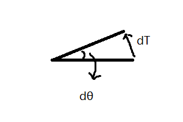

<h1>
 题目:TODO 
</h1>

<h2>摘要</h2>

TODO

<h2>引言</h2>

&emsp;&emsp;平面曲线在生活中处处可见，各种屏幕上显示出来的图形的轮廓就是由二维的平面曲线构成，而各种文字也是由平面曲线构成。而对于平面曲线，我们可以很直观的感觉的不同曲线在不同地方弯曲程度不同。例如下图中的一条直线和一个圆，我们很明显能感知到圆的弯曲程度要大于直线。

&emsp;&emsp;然而，这样的对于“弯曲程度”的感知只是一种直觉上的感知，是基于比较且不能量化的。对于给定参数的一个平面曲线，我们应该发展出数学的工具来给出一个点附近弯曲程度的严格定义。而到了高维度，甚至是超过了我们所生活的三维空间更高维度，我们的直觉就完全失效了。这就更加需要我们发展出一套数学理论来解决这样的问题。

&emsp;&emsp;事实上，这样的理论工具在生活中也大有用处。它可以和物理学工程学等结合，进而用于解决实际生活的一些问题。

<h2> 主体 </h2>

<h3> 一般曲线的表示 </h3>

<h4> 弧长参数 </h4>

&emsp;&emsp;在数学上，一条曲线的定义为：设 ${\displaystyle I=[a,b]}\ I=[a,b]$ 为一实数区间，即实数集的非空子集，那么曲线 $c$ 就是一个连续函数 $c : I → X$ 的映像，其中 $X$ 为一个拓扑空间。[1]

&emsp;&emsp;因此，对于 $\mathbb{R}^n$ 的任意一条曲线，我们都可以把其写成每一个维度的分量关于参数 $t$ 的形式，记作 $x_i = x_i(t)$ 。因此，曲线的位矢可写作展开形式 $\vec{r} = (x_1(t),x_2(t),...,x_n(t))$ ，其中 $t \in [a,b]$ 。

&emsp;&emsp;然而，这样的的表示是不完美的，其存在一个与曲线本身无直接关联的参数 $t$ 。例如，对于任意 $t'$ 和单调增函数 $f$ 满足 $f(t') \in [a,b] \ (t\in[c,d])$ ，$t$ 和 $t'$ 存在一一映射的关系。因此， $\vec{r} = (x_1(t),x_2(t),...,x_n(t)) = (x_1(f(t')),x_2(f(t')),...,x_n(f(t'))) = (x_1'(t'),x_2'(t'),...,x_n'(t'))$。可以看出，曲线的表示依赖于参数 $t$ 的选取，将 $t$ 替换为 $t'$ 之后，曲线的表示发生改变。这显然不是一个很本质的表示。

&emsp;&emsp;事实上，我们可以考虑下参数 $t$ 的现实意义，在一条曲线相同位置固定 $d\vec{r}$ 的情况下，选择不同的参数， $dt$ 也会不同。若把 $t$ 当作为时间，$\vec{r}$ 当作位移，那么不同的 $t$ 则对应了我们在曲线上移动的速度  $\frac{d\vec{r}}{dt}$ 不同。

&emsp;&emsp;为了解决这一问题，我们引入新的一个参数 $ds$，定义 $ds = \sqrt{dx_1^2+dx_2^2+...+dx_n^2}$ ，$ s= \int{ds} + C $。

&emsp;&emsp;为了简化讨论，我们将讨论范围局限于 **正则曲线**[2]，即满足 $\vec{r}$ 对于 $t$ 处处可微的曲线。此时，将 $\vec{r(t)}$ 可写作 $\vec{r(s)}$。由复合函数求导公式， $\frac{d\vec{r}}{ds} = \frac{d\vec{r}/dt}{ds/dt}$ 。而注意到 $|d\vec{r}| = \sqrt{dx_1^2+dx_2^2+...+dx_n^2}$，因此 $|\frac{d\vec{r}}{ds}| = 1$。该参数与曲线本身密切相关，用前面的现实意义去分析，$s$ 就可以理解为固定速度为1的在曲线上移动。

&emsp;&emsp;我们将上述参数定义为**弧长参数**，其是一个只与曲线本身相关的曲线的参数表示，其中曲线需要满足正则曲线的性质。

<h4> 切线 </h4>

&emsp;&emsp;在最开始发展微分理论的时候，导数就是用来求出函数在一个点的切线方向的工具。在平面直角坐标系中，函数一点的切线的一个方向向量为 $(1,\frac{dy}{dx})$ 。而对于任意的可弧长参数化的曲线 $\vec{x} = \vec{x}(s) $ ，我们可以回到切线的定义去求出切线方向。我们设切线这条直线的参数形式为 $\vec{y} = \vec{y}(s)$ ，在 $ s = s_0 $ 处相切，因此 $\vec{y}(s_0) = \vec{x}(s_0)$ ，且在 $s_0$ 附近，两条曲线要尽可能地接近。令 $\delta{s} =s -s_0$ ，则:

$$
\begin{aligned}
|\vec{y}(s) - \vec{x}(s)| 
&= \sqrt{\sum_{i=1}^{n}{(y_i(s) - x_i(s)) ^ 2}} \\
&= \sqrt{\sum_{i=1}^{n}{(\frac{dy}{ds}-\frac{dx}{ds})^2 \cdot\delta{s}^2} + o({(δs)^2})} \\
&= |\frac{d\vec{y}}{ds} - \frac{d\vec{x}}{ds}| \cdot \delta{s} +o(\delta{s})
\end{aligned}
$$

&emsp;&emsp;不难看出，当切线满足 $\frac{d\vec{y}}{ds} = \frac{d\vec{x}}{ds} (s=s_0)$ 时候，在 $s_0$ 附近两者最接近，所以曲线地切线方向地一个方向向量即为 $\frac{d\vec{x}}{ds}$ 。注意到 $|\frac{d\vec{x}}{ds}| = 1$，所以其也是切向的单位向量。记**单位切向量**为 $\vec{T} = \frac{d\vec{x}}{ds}$ ，满足 $|\vec{T}| = 1$。

<h3> 二维曲线 </h3>

<h4> 二维曲线的法向量与曲率 </h4>

&emsp;&emsp;为了简单起见，我们先从二维的情况开始讨论。二维曲线在一个平面内，除了切向量，其还存在恰好一个方向向量与切向量相切，记这个方向为**法向**。此时，由于 $|\vec{T}| = 1$ ，因此 $\vec{T} \cdot \vec{T} = 1$ 。左右对 $s$ 求导，$\frac{d\vec{T}}{ds} \cdot \vec{T} = 0$ 。因此可以得出，$\frac{d\vec{T}}{ds} \perp \vec{T}$ ，其沿法向。我们记**单位法向量** $\vec{N} = \frac{\frac{d\vec{T}}{ds}}{|\frac{d\vec{T}}{ds}|} $ 。

&emsp;&emsp;而曲线的曲率被定义为曲线转动的快慢，即在一个点附近切向转过角度与偏离位移大小的比值的极限。对于二维的曲线，因为在弧长参数下 $\vec{T}$的模长保持不变，其装过的角度 $\delta \theta = \frac{|\delta{\vec{T}}|}{|T|} = |\delta{\vec{T}}|  $ ，如下图所示。

&emsp;&emsp;因此，记**曲率的大小**为 $\kappa$ ，由定义，$\kappa = \lim_{\delta s \rightarrow 0}{\frac{δθ}{δs}} = \lim_{\delta s \rightarrow 0}{\frac{|\delta {\vec{T}}|}{\delta s}}\cdot{\frac1{|\vec{T}|}} = |\frac{d\vec T}{ds}|$ ，所以由单位法向量 $\vec{N}$ 的定义，$\frac{d\vec T}{ds} = \kappa \vec{N}$ 。 在一般情况下，我们还用记曲率半径 $\rho = \frac1{\kappa}$ 。对于一个特殊的曲线:圆，该曲率半径就等于圆的半径。

<h4> 切向量、法向量与曲率的其他性质 </h4>

&emsp;&emsp;由上，在二维弧长参数 $\vec{r} = \vec{r}(s)$ 下 ，我们已经定义了如下三个量:

$$
\begin{aligned}

\vec{T} &= \frac{d\vec{r}}{ds} \\
\kappa  &= |\frac{d\vec{T}}{ds}| \\
\vec{N} &= \frac{1}{\kappa} \cdot \frac{d\vec{T}}{ds} \\

\end{aligned}
$$

&emsp;&emsp;而这些量之间还存在一些内在的联系。由 $|\vec{T}| = 1$，即 $\vec{T}\cdot\vec{T} = 1 $ ，对两边求二阶导，$\frac{d^2\vec{T}}{ds^2} \cdot T + (\frac{d\vec{T}}{ds})^2 = 0 $ 此时由定义以及 $|\vec{N}| = 1$ ，有 $\frac{d^2\vec{T}}{ds^2} \cdot \vec{T} = -\kappa^2$。记为(1)式。

&emsp;&emsp;类似的，因为 $|\vec{N}| = 1$ 即 $\vec{N}\cdot\vec{N} = 1$，我们对两边对 $s$ 求导 $\vec{N}\cdot \frac{d\vec{N}}{ds} = 0$ ，所以可知 $\vec{N} \perp \frac{d\vec{N}}{ds}$。又因为已经证过 $\vec{T} \perp \frac{d\vec{T}}{ds} = \kappa\cdot{\vec{N}}$ ，所以 $\frac{d\vec{N}}{ds} $ 与 $\vec{T}$ 共线。再带入 ${\vec N} $ 的定义，以及(1)式，可知 $\frac{d{\vec{N}}}{ds} = -\kappa \vec{T}$

&emsp;&emsp;因此，我们可以总结出下面几个常用的式子。

$$
\begin{aligned}

\vec{T} &= \frac{d\vec{r}}{ds} \\
\vec{N} &= \frac{1}{\kappa} \cdot \frac{d^2\vec{r}}{ds^2} \\
\\
\frac{d\vec{T}}{ds} &= {\kappa} \cdot {\vec{N}} \\
\frac{d\vec{N}}{ds} &= -{\kappa} \cdot {\vec{T}} \\
\\
\frac{d^2\vec{T}}{ds^2} &= - \kappa ^ 2 \cdot \vec{T} \\

\end{aligned}
$$

<h4> 法向量与切向量的现实意义 </h4>

&emsp;&emsp;事实上，回到最初的含有 $t$ 的参数表示形式，我们只需将每一个 $ds$ 换为 $\frac{ds}{dt} \cdot dt$ 即可。而此时，$\frac{ds}{dt}$ 对于的是现实世界中的运动速度，而 $t$ 对应的是时间。将上述式子整理化简，我们可以得到:

$$
\begin{aligned}

\frac{ds}{dt}\cdot\vec{T} &= \frac{d\vec{r}}{dt} \\
\kappa \cdot (\frac{ds}{dt}) ^ 2 \cdot \vec{N} + \frac{d^2s}{dt^2}\cdot\vec{T} &= \frac{d^2\vec{r}}{dt^2}  \\

\end{aligned}
$$

&emsp;&emsp;而在物理中，两个式子的右边分别对应的是速度矢量和加速度矢量。左边的 $\frac{ds}{dt}$ 为速度大小，$\frac{d^2s}{dt^2}$ 为速度大小的变换率。可以看出，质点在曲线上运动的时候，除了切线方向速度大小改变带来切向加速度，由曲率还会带来一项法向的加速度，这便是人们常说的向心加速度。而通过二维曲线切向量法向量相关的知识，我们便能很容易地研究二维曲线上的质点运动问题。

<h3> 三维曲线 </h3>

<h4> 三维曲线的法向与曲率 </h4>

&emsp;&emsp;对于三维曲线，其切线方向的单位向量依然可以由 $T = \frac{d\vec{r}}{ds}$ 得出。而对于三维的曲线，与其垂直的方向构成了一个平面。因此，我们不能像二维那样将法向定义为与切向垂直的方向，因为这样的方向有无数个。然而，我们依然可以从法线的另外一个性质“切向量变化的方向”入手，来定义法向量。类似二维曲线，通过切向量转过的角度的大小与通过距离的比值，我们依然可以定义**曲率** $\kappa = \lim_{\delta s \rightarrow 0}{\frac{δθ}{δs}} = \lim_{\delta s \rightarrow 0}{\frac{|\delta {\vec{T}}|}{\delta s}}\cdot{\frac1{|\vec{T}|}} = |\frac{d\vec T}{ds}|$ 。而我们将切向量变化的方向定义为 **法向**，则可以得到与二维情况下相同的形式 $\vec{N} = \frac1{\kappa}\cdot\frac{d\vec{T}}{ds}$。

<h4> 三维曲线的副法向与曲率 </h4>

&emsp;&emsp;由此，我们可以得到相互正交的两个方向:切向和法向。但在一个三维空间中，任何一组标准正交基应当存在三个互相垂直单位向量。因此，我们可以通过叉乘给出第三个单位向量，记**副法向的单位向量** $\vec{B} = \vec{T} \times \vec{N}$ 。此时，$\vec{T},\vec{N},\vec{B}$ 构成了该三维空间中的一组标准正交基。

&emsp;&emsp;由正交性，$\vec N \cdot \vec T = 0$ 。两边对 $s$ 求导，并带入 $\vec N = \frac1{\kappa} \cdot \frac{d\vec T}{ds} $，可得 $\frac{d\vec N}{ds} \cdot \vec T = -\kappa$ 。记为(1)式。
&emsp;&emsp;由于 $|\vec{N}| = 1$ 即 $\vec N \cdot \vec N = 1$ ，两边对 $s$ 求导有 $\vec N\cdot \frac{d\vec N}{ds} = 0$ 可知 $\vec N \perp \frac{d\vec N}{ds}$ 。因此，可在标准正交基框架下设 $\frac{d\vec N}{ds} = \alpha \vec T + \beta \vec B $。记为(2)式。

&emsp;&emsp;将(2)带入(1),可知 $\alpha = -\kappa$ 。

&emsp;&emsp;而类似(2)式，我们可以设 $\frac{d\vec B}{ds} = \gamma \vec T + \xi \vec N $ ; 类似(1) 式，我们也能写出 $\frac{d\vec B}{ds} \cdot \vec T = -\vec{B} \cdot \frac{d\vec T}{ds} $ 以及 $ \frac{d\vec B}{ds} \cdot \vec N = -\vec{B} \cdot \frac{d\vec N}{ds} $ 。容易求出，$\gamma = 0,\xi = -\beta$。

&emsp;&emsp;汇总一下，我们可以得到如下这些式子。

$$
\begin{aligned}

\vec{T} &= \frac{d\vec{r}}{ds}\\
\\
\frac{d\vec T}{ds} &= \kappa \cdot \vec N \\
\frac{d\vec N}{ds} &= -\kappa \cdot \vec T + \beta \cdot \vec B\\
\frac{d\vec B}{ds} &= -\beta \cdot \vec N \\

\end{aligned}
$$

&emsp;&emsp;其中，$\vec B$ 是由 $\vec T \times \vec N$ 定义得到，$\beta$ 是一个曲线相关的常数，其绝对值大小等于 $|\frac{d\vec N}{ds} + \kappa \cdot \vec T|$，称为**挠率**。

<h4> 挠率的几何直观 </h4>

&emsp;&emsp;至今为止，我们只是从理论上推导出了挠率的值，却没有给出其背后的意义。我们对上述最后一个式子取模长，有 $|\beta| = |\frac{d\vec B}{ds}|$。而利用 定义式: $\vec B = \vec T \times \vec N$ ，我们可以得到：$\beta$ 的大小等于副法向量转动的角度的快慢，即法向量切向量构成的平面转动的角度 $\delta \phi$ 与 $ds$ 的比值的极限。

&emsp;&emsp;最直观的例子就是弹簧的螺线，其在不同的地方有相同的疏密，但是不同弹簧疏密不同。假设所有弹簧在水平的投影圆半径相同，此时，弹簧钢丝绕的越稠密的，其挠率越小。反之在稀疏的地方，其挠率越大。

<h3> 高维曲线 </h3>

<h2> 参考资料 </h2>

[1]维基百科:曲线 https://zh.wikipedia.org/wiki/%E6%9B%B2%E7%BA%BF
[2]维基百科:曲线的微分几何。 https://zh.wikipedia.org/wiki/%E6%9B%B2%E7%BA%BF%E7%9A%84%E5%BE%AE%E5%88%86%E5%87%A0%E4%BD%95
[3]维基百科:弗莱纳公式。 https://zh.wikipedia.org/wiki/%E5%BC%97%E8%8E%B1%E7%BA%B3%E5%85%AC%E5%BC%8F
