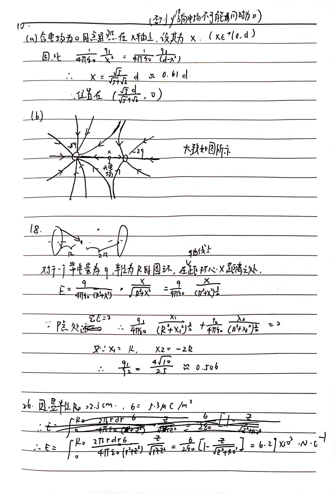
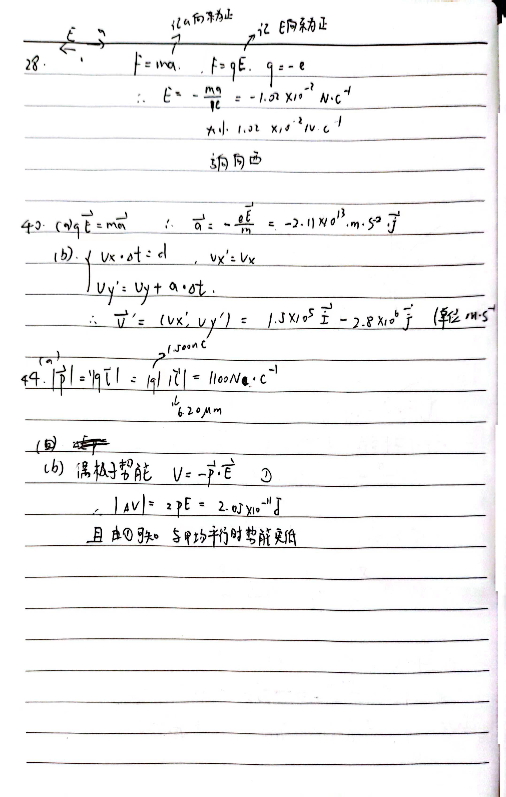

# T1

油滴发生器产生的小油滴，直径在 $0.5$ ~ $1 \mu m$ 。需要注意，若油滴的大小太小，则布朗运动的影响会过大，且不易观察。若油滴太大，则带的电荷较多，且下降的时间快，不易控制找到稳定的电压。

我们考虑油滴的直径为 $d = 1.0 \ \mu m$ 左右，其密度为 $\rho = 0.981 \times 10 ^ 3 \ kg \cdot m^{-3}$ ，其质量为 $m = \frac \pi 6 \rho d ^ 3 = 5.13 \times 10^{-16} \ kg$ 。我们假定电荷量 $q = ne $ ，其中 $e$ 为元电荷。对于平行板电容器，我们假设其尺寸远大于油滴的大小，那么板间电场可近似为 $E = \frac U {d_1}$ 。由于重力和电场力平衡，我们可以得到: $mg = ne \frac{U}{d_1} $ 。

我们取 $g = 9.8 \ m \cdot s^{-2}$ ，取间距 $d_1 = 5.0 \times 10 ^ {-2} \ m $ ，取 $n$ 为 $5$ ，估算得到所需电压 $U = 3.1 \times 10^2 \ V$ 。实际采用电压为 $300$ ~ $700 \ V$

实际计算公式大致如下:

首先测出油滴的质量。在没有电场作用的情况下，油滴会受到重力和空气阻力，由于其本身尺寸小，质量与 $r^3$ 成反比，而阻力一般近似为 $f = 6\pi r \eta v$，$\frac {f} {m}$ 关于 $r^2$ 成反比 。因此，油滴因为体积小，在下落短暂时间之后 (因为 $\frac {f} {m}$ 关于 $r^2$ 成反比而变大，所以时间不会太久) ，将会近似匀速直线下降。此时 $f = mg$ 。

因此，当两个极板之间的电压为 0 ，设此时匀速下降的距离为 $l$ ，时间为 $t$ 。则:

$$
v = \frac{l}{t} \\
f = 6\pi r \eta v   \\
f = mg \\
m = \frac 4 3 \pi \rho r ^ 3 \\
mg = ne\frac{U}{d_1} \\
$$

因此:

$$
e = \frac{1}{n} \frac{9\sqrt{2}\pi}{\rho g} \lbrack \frac{\eta l}{t} \rbrack ^ {\frac 3 2} \\
r = \sqrt{ \frac{9\eta l}{2\rho gt} }
$$

# T2

A4 纸(仅仅用于估算纸片质量) 大小为 $21.0 \ cm \times 29.7  cm$ ，质量约为 $ 4.37 g$ 。估计纸片大小为 $1.0 \ cm \times 1.0 \ cm$ ，质量约为 $7.0 \times 10 ^{-6} \ kg$ 。取 $g = 9.8 \ m \cdot s ^ {-2} $ ，则重力大约为 $ 6.9 \times 10 ^ {-5} \ N$ 。我们不妨假定电荷面密度 $ \sigma = const $ ，并且把塑料尺看作理想无穷大的平面 (因为纸片相比于尺子较小，且吸引时两者距离非常接近) ，则由高斯公式 $\nabla \cdot \vec{E} = \frac \rho {\epsilon_0} $ 易知其产生电场强度 $E = \frac {\sigma}{2 \epsilon_0}$ 。我们假设两种材料上电荷异号，那么由于能够吸引，且因为间隔要足够近才能吸引，所以可以认为满足电场力近似等于或略强于纸片重力 $Eq \simeq mg$ ，而 $q = \sigma a^2$ 。所以代入，得到 $q = \sqrt{2\epsilon_0 mg} \ a = 3.5 \times 10 ^ {-10} \ C$

# T3

铯-133 原子不受干扰的基态超精细能级跃迁频率 $\Delta \nu_{Cs}$ 为 $9 192 631 770 \ Hz$

- 真空中光的速度 $c$ 为 $ 299 792 458 \ m \cdot s ^ {-1}$
- 普朗克常数 $h$ 为 $6.626 070 15 \times 10^{-34} \ J\cdot s$
- 基本电荷 $e$ 为 $1.602 176 634 \times 10^{-19} \ C$
- 玻尔兹曼常数 $k$ 为 $1.380 649 \times 10^{-23} \ J \cdot K ^ {-1} $
- 阿伏伽德罗常数 $N_A$ 为 $6.022 140 76 \times 10^{23} mol ^ {-1}$
- 频率为 $540 \times 10^{12} \ Hz$ 的单色辐射的发光效率 $K_{cd}$ 为 $683 \ lm \cdot W ^{-1}$

而精细结构常数 $\alpha$ 为 $7.297 352 5693 \times 10^{-3}$  ($\frac{1}{\alpha} = 137.035 999 084$) 为测量量。

1. 电荷: 已被定义
2. 电流: 1安培等于每秒钟通过导线横截面的电荷量为1库伦的电流。$1 \ A = 1 \ C \cdot s ^ {-1}$
3. 光速: 已被定义
4. 真空介电常数: $\epsilon_0 = \frac {e ^ 2} {2 \alpha h c} = 8.854 187 8128 \times 10^{-12} \ F \cdot m ^ {-1}$
5. 真空磁导率: $\mu_0 = \frac {1} {\epsilon_0 c ^ 2} = 1.256 637 062 12 \times 10^{-6} \ N \cdot A ^ {-2}$

特别的是，在新定义下，真空介电常数 与 真空磁导率不再是常数，其不确定度与精细结构常数 $\alpha$ 有关。

参考资料 : [wiki](https://zh.wikipedia.org/wiki/2019%E5%B9%B4%E5%9C%8B%E9%9A%9B%E5%96%AE%E4%BD%8D%E5%88%B6%E5%9F%BA%E6%9C%AC%E5%96%AE%E4%BD%8D%E9%87%8D%E6%96%B0%E5%AE%9A%E7%BE%A9)

