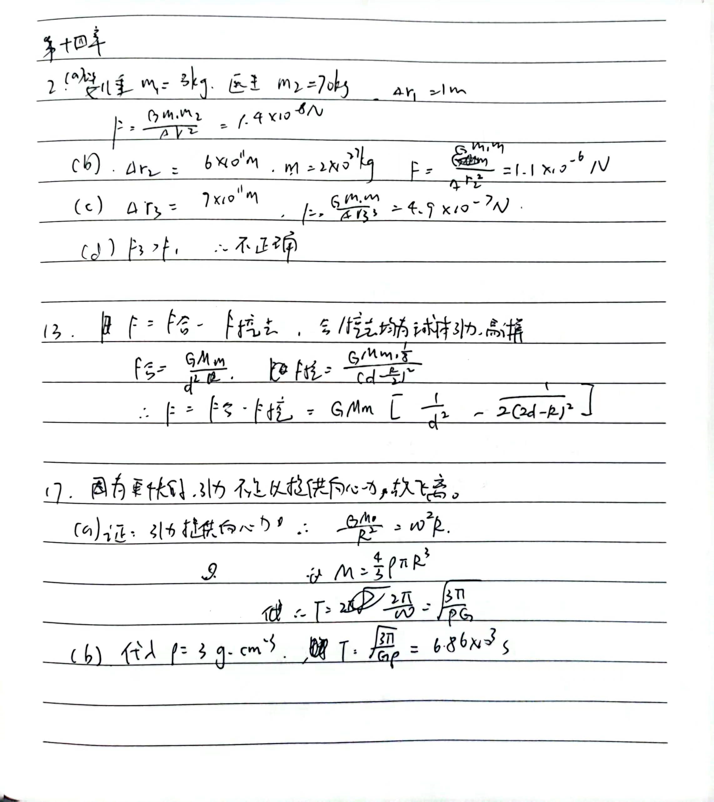
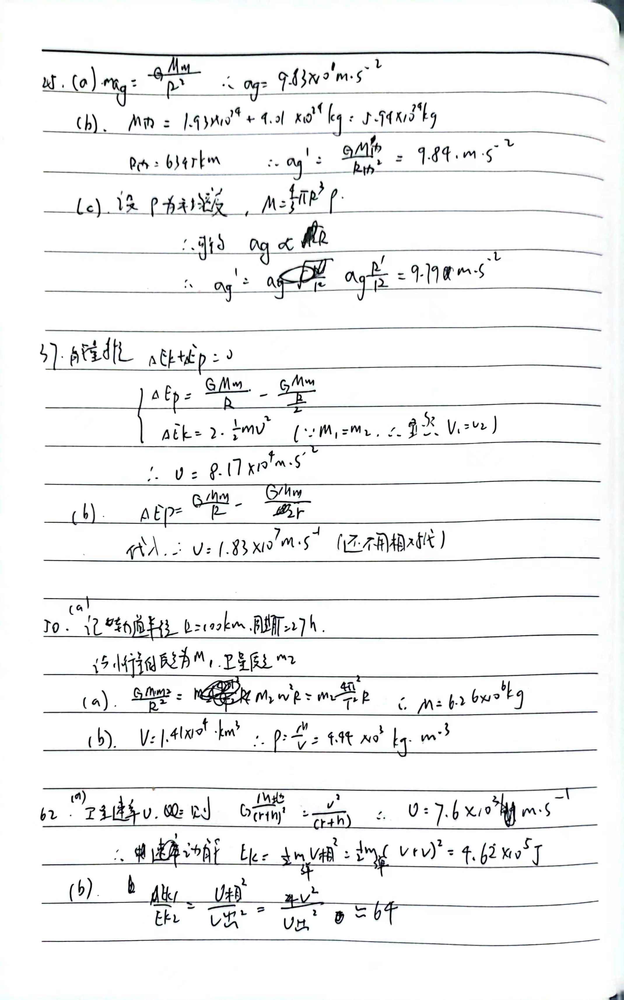

# 5.1

$E = E_p + E_k$ 。对于地球圆周运动，满足 $E_p = -2E_k$ ，因此所需能量 $\Delta E = 0 - E = E_k$ ，而 $E_k = \frac12 m v^2$ ，其中 $v \cdot T = 2\pi *R$ ，地日半径 $R = 1.50 × 10^{11} m $， 周期 $T = 365 * 24 * 3600 s$ ，而相对论质能关系为 $\Delta E = \Delta m c^2$ ，其中光速 $c = 3.0 \times 10^8 m\cdot s^{-1} $ ，地球减少质量 $\Delta m$，地球质量 $m$ 。因此，$\frac{\Delta m}{m} = 4.96 \times 10 ^{-9}$

# 5.2

万有引力常量 $G = 6.67 \cdot 10 ^{-11} N ^{-1} \cdot m^2 \cdot kg ^ {-2} $ ，由互联网知，金矿质量一般在 $ 10^3 t$ 附近，我们直接用极端情况，算最大金矿质量为 $m = 10^5 t$ (事实上绝对不可能达到)，并且假设金矿石深度只有 $h = 1km$。此时，我们再次做极端假设，认为之前那些位置均为空气，因此 $\Delta g = \frac{Gm}{h ^ 2} = 6.67 \times 10 ^{-9} $，因此 $\frac {\Delta g} g = 6.8 \times 10 ^{-10}$ 。此时，利用 $T = 2\pi \sqrt{\frac l g}$，得知，$\frac {\Delta T} T = \frac 1 2(\frac{|\Delta L|} L + \frac{|\Delta g|} g) $。因此，其若带来影响，则摆长相对误差不能超过 $10 ^ {-8}$ 数量级，但是显然，假设摆长 $1m$ (事实上也达不到)，摆场相对误差显然也远大于 $10^{-9}$，更别说单摆误差的不准确性 (本质是对于椭圆积分的近似，存在和角度相关的高阶项)，空气阻力的影响。因此，绝对不可能到达这样的精度。

