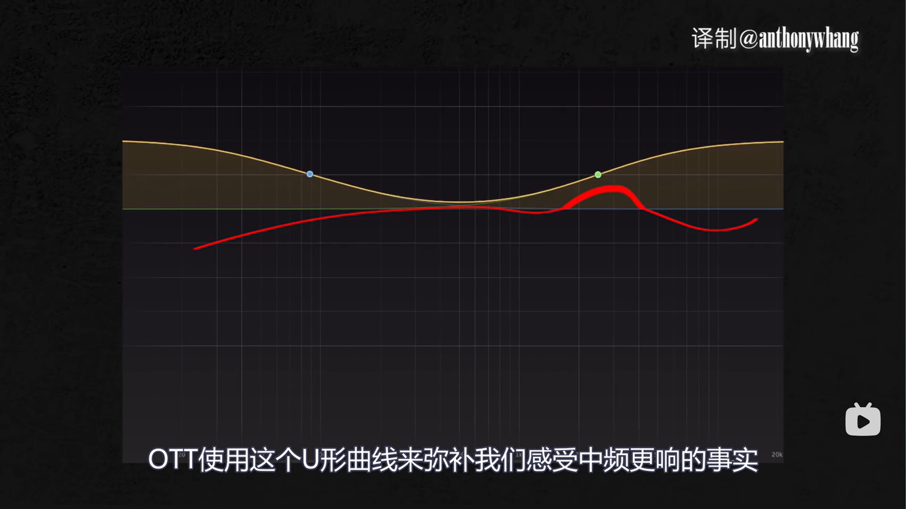

# OTT : multiband compressor
https://www.bilibili.com/video/BV1oZ4y1q7PY/

feature(bug): 
- 在分频点有相移(一般分3 band)

高压缩值 + 较长 attack release
- 动态很小，细节被放大

中频压缩少，其他频段压缩大
- 主要原因是人耳对于中频极容易感知
- 保护了中频的动态

微笑曲线
- 频率分布像 U ，高低频提升
- 为了迎合人耳的响度感知曲线

